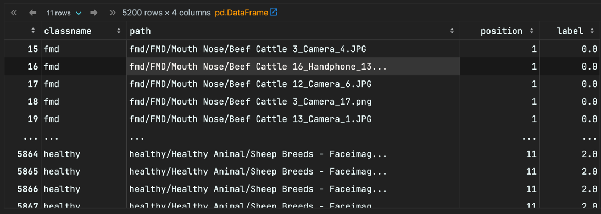

# Dataset Preparation

Refer to the preprocessing notebook [EDA_v7.ipynb](../code/notebooks/EDA_v7.ipynb) for details.

Dataset Downloading : https://drive.google.com/drive/folders/1Z6ARaAh_61VQZ7qHEYbTsfYQmq-pod-B

You should unzip the zips from the above links to align following directory structures 

```bash
├── fmd
│   ├── Drooling
│   ├── FMD
│   ├── Leg
│   ├── Mouth Nose
│   ├── Teats
│   └── Tongue
├── healthy
│   ├── Cattle
│   ├── Cow - diff angles
│   ├── Healthy Animal
├── lsd
│   ├── CloseUp Skin
│   ├── CloseUpSkin
│   ├── FullBody
│   ├── Head
│   ├── Leg
│   └── Uncertain
```

### Build the label file according to the categories and positions

```python
sub_dirs = list_directories_recursively(train_main_path)
positions = []
for one_class in all_classes:
    for one_sub in sub_dirs:
        if one_class.lower() in one_sub.lower():
            for one_file in os.listdir(one_sub):
                classes.append(one_class)
                single_file_path = one_sub+one_file
                pos_flag = False
                for one_pos in position:
                    if one_pos.lower() in single_file_path.lower() and not pos_flag:
                        pos_flag = True
                        positions.append(one_pos)
                if not pos_flag:
                    positions.append('uncertain')
                paths.append(single_file_path)

train_df['classname'] = classes
train_df['path'] = paths
train_df['position'] = positions
print(train_df.head())
print(train_df.info())
```

The provided code is for organizing and categorizing image files based on certain classifications related to two diseases (fmd and lsd) and a healthy status. The image files are presumably named or stored in a manner that indicates their classification and the position associated with the images (e.g., leg, mouth, teats, etc.).

#### Definitions

1. **fmd**: Represents images that are categorized under the disease fmd. The possible positions associated with this category are:
    - leg
    - mouth
    - teats
    - tongue
    - drooling
    - uncertain

2. **lsd**: Represents images categorized under the disease lsd. The possible positions for this category are:
    - skin
    - body
    - head
    - leg
    - uncertain

3. **healthy**: Represents images that are categorized as healthy.

#### Code Structure

- **all_classes**: This list contains the three primary categories of the images, namely 'fmd', 'lsd', and 'healthy'.

- **position**: This list holds the various positions or characteristics that can be associated with an image based on its filename.

- **sub_dirs**: This list is populated by the function `list_directories_recursively()` which (as inferred from the name) likely returns a list of directory paths from the main training path `train_main_path`.

- The nested `for` loops iterate through each class and each sub-directory to classify the images accordingly.

- For each file in the sub-directory, the loops check for its classification and associated position by examining its path.

- After processing all files, the classifications and paths are added to a DataFrame `train_df` which also includes the position inferred from the file paths.

### Clean the Label file by remove unsupported suffix

The provided code segment is focused on filtering and modifying the `train_df` DataFrame which presumably contains data about image files related to some form of training set. Specifically, the code narrows down the dataset to include only entries that have paths pointing to `.jpg`, `.png`, or `.jpeg` images. After filtering, the code modifies the 'path' column of this filtered dataframe to remove the base directory (`train_main_path`) from each file path.

1. **Filtering Image Extensions**:

    ```python
    train_df_data = train_df[train_df['path'].str.contains('jpg|png|jpeg',case=False,regex=True)]
    ```

    - The DataFrame `train_df` is filtered using the `str.contains()` method to select only those rows where the 'path' column contains either 'jpg', 'png', or 'jpeg'. This essentially narrows down the data to only include entries associated with these image formats.
    
    - `case=False` ensures that the match is case insensitive, so it will match 'JPG', 'jpg', 'PNG', 'png', etc.

    - `regex=True` specifies that the provided string 'jpg|png|jpeg' should be interpreted as a regular expression. The pipe symbol `|` acts as a logical "OR", meaning it will match any of the provided substrings.

2. **Modifying the 'path' Column**:

    ```python
    train_df_data['path'] = train_df_data['path'].str.replace(train_main_path, '')
    ```

    - This line modifies the 'path' column of the `train_df_data` DataFrame. It replaces the base directory, represented by the variable `train_main_path`, with an empty string (`''`). This has the effect of removing the base directory from the file paths, presumably leaving only the relative paths of the image files.

### Clean the Label file by remove duplication entries

The provided code snippet is focused on detecting and removing duplicate image entries in the `train_df_data` DataFrame based on their file names. If two or more image files have the same name (even if they are in different directories), all but one of them will be considered duplicates, and the subsequent occurrences will be removed from the DataFrame. A progress bar is displayed using `tqdm` to monitor the progress of the loop as it processes the file paths.

1. **Initialization**:

    ```python
    store = []
    duplicate = []
    ```

    - Two lists, `store` and `duplicate`, are initialized. While the `duplicate` list is initialized, it is not used within the provided code. The `store` list will be used to keep track of unique file names that have been encountered so far.

2. **Processing with Progress Bar**:

    ```python
    for file_names in tqdm(train_df_data['path']):
    ```

    - `tqdm` is a library that wraps around any iterable, providing a visual progress bar. Here, it is used to wrap around the 'path' column of the `train_df_data` DataFrame, which contains the file paths of images.

3. **Extracting File Name**:

    ```python
    r_file_name = file_names.split('/')[-1]
    ```

    - For each file path (`file_names`), the code extracts just the file name by splitting the path using the forward slash (`/`) as a delimiter and taking the last element. This method assumes a UNIX-like file system convention. If you're using Windows, the path might use a backslash (`\`) instead.

4. **Duplicate Detection and Removal**:

    ```python
    if r_file_name in store:
        print(file_names)
        train_df_data.drop(train_df_data[train_df_data['path'] == file_names].index, inplace = True)
    else:
        store.append(r_file_name)
    ```
    - If the extracted file name (`r_file_name`) is already in the `store` list, it is considered a duplicate. The code then prints the duplicate file's path and removes its corresponding row from the `train_df_data` DataFrame using the `drop()` method.

    - If the file name is not already in the `store` list, it's considered unique, and the name is added to the `store` list.

### Resize the original Images to Same Resolutions

we need to downsample the original images to correct size in order to save GPU memory for training .

The provided code focuses on resizing images from a specified dataset (`train_df_data`) and then saving these resized images to a designated directory. The resizing is executed using the `cv2` library, which is a part of OpenCV, a well-known computer vision library. The code also ensures the creation of necessary directories and validates the readability of images before processing.


1. **Setting Save Path**:

    ```python
    save_path = '/home/akide/dataset/Cattle-Disease-Classification/v2_resized/'
    ```

    - Specifies the path where the resized images will be saved.

2. **Ensure Save Directory Exists**:

    ```python
    if not os.path.exists(save_path):
        os.makedirs(save_path)
    ```

    - Before processing the images, the code ensures that the `save_path` directory exists. If it doesn't, the directory is created using `os.makedirs()`.

3. **Processing Each File**:

    ```python
    for file_name in tqdm(train_df_data['path']):
    ```

    - A loop, wrapped with a `tqdm` progress bar, iterates through each file path in the 'path' column of the `train_df_data` DataFrame.

4. **Determining Full File Path**:

    ```python
    full_path = os.path.join(train_main_path, file_name)
    ```

    - Constructs the full path of the image file by joining the main training path (`train_main_path`) with the individual `file_name`.

5. **Create Sub-directories**:

    ```python
    dir_name = '/'.join(file_name.split('/')[:-1])
    dir_name = os.path.join(save_path, dir_name)
    if not os.path.exists(dir_name):
        os.makedirs(dir_name)
    ```

    - Extracts the directory structure from the `file_name` and ensures it exists within the `save_path`. If not, it's created. This helps in preserving the original directory hierarchy.

6. **Image Readability Check**:

    ```python
    if not is_cv2_readable(full_path):
        print(file_name)
        continue
    ```

    - Uses a function `is_cv2_readable()` to verify if the image at `full_path` can be read by `cv2`. If it's unreadable, the image's file name is printed, and the code skips to the next iteration.

7. **Image Reading and Resizing**:

    ```python
    image = cv2.imread(full_path)
    target_size = (384, 384)
    resized_image = cv2.resize(image, target_size)
    ```

    - The image is read from its `full_path`, then resized to the dimensions 384x384 using `cv2.resize()`.

8. **Saving the Resized Image**:

    ```python
    cv2.imwrite(os.path.join(save_path, file_name), resized_image)
    ```

    - The resized image is saved back to the `save_path` directory, preserving its original name and relative path.

### Save to a label file 

```python
train_df_data.to_csv('v_3_out.csv',index=False)
```

in format of 

